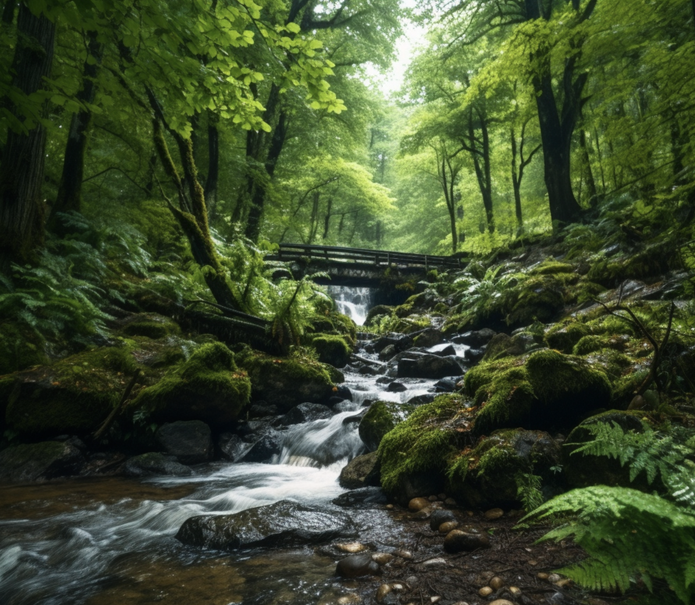

# 🌳 ForestQuery Global Deforestation Report (1990-2016) 🌳

ForestQuery is on a mission to combat deforestation around the world and to raise awareness about this topic and its impact on the environment. The data analysis team at ForestQuery has obtained data from the World Bank that includes forest area and total land area by country and year from 1990 to 2016, as well as a table of countries and the regions to which they belong.

## 1. GLOBAL SITUATION 🌍

According to the World Bank, the total forest area of the world was 41,282,694.9 sq km in 1990. As of 2016, the most recent year for which data was available, that number had fallen to 39,958,245.9 sq km, a loss of 1,324,449 sq km, or 3.21 %.

The forest area lost over this time period is slightly more than the entire land area of Peru listed for the year 2016 (which is 1,279,999.9891 sq km).

## 2. REGIONAL OUTLOOK 🌎

In 2016, the percent of the total land area of the world designated as forest was 31.38%. The region with the highest relative forestation was Latin America & Caribbean, with 46.16%, and the region with the lowest relative forestation was Middle East & North Africa, with 2.07% forestation.

In 1990, the percent of the total land area of the world designated as forest was 32.42%. The region with the highest relative forestation was Latin America & Caribbean, with 51.03%, and the region with the lowest relative forestation was Middle East & North Africa , with 1.78% forestation.

## Table 2.1: Percent Forest Area by Region, 1990 & 2016:

Region                  | 1990 Forest Percentage | 2016 Forest Percentage
----------------------- | --------------------- | ---------------------
Sub-Saharan Africa      | 32.19                 | 27.56
South Asia              | 16.51                 | 17.51
North America           | 35.65                 | 36.04
Middle East & North Africa | 1.78                  | 2.07
Latin America & Caribbean | 51.03                 | 46.16
Europe & Central Asia   | 37.27                 | 38.06
East Asia & Pacific     | 25.77                 | 26.36

The only regions of the world that decreased in percent forest area from 1990 to 2016 were  Latin America & Caribbean (dropped from 51.03% to 46.16%) and Sub-Saharan Africa  (32.19% to 27.56%). All other regions actually increased in forest area over this time period. However, the drop in forest area in the two aforementioned regions was so large, the percent forest area of the world decreased over this time period from 32.42% to 31.38%. 

## 3. COUNTRY-LEVEL DETAIL 🏞️

### A. SUCCESS STORIES ✨

There is one particularly bright spot in the data at the country level, China. This country actually increased in forest area from 1990 to 2016 by 527,229.062 sq km. It would be interesting to study what has changed in this country over this time to drive this figure in the data higher. The country with the next largest increase in forest area from 1990 to 2016 was the United States, but it only saw an increase of 79,200 sq km, much lower than the figure for China.

United States and China are of course very large countries in total land area, so when we look at the largest percent change in forest area from 1990 to 2016, we aren’t surprised to find a much smaller country listed at the top. Iceland increased in forest area by  343.99 % from 1990 to 2016.

### B. LARGEST CONCERNS ⚠️

Which countries are seeing deforestation to the largest degree? We can answer this question in two ways. First, we can look at the absolute square kilometer decrease in forest area from 1990 to 2016. The following 3 countries had the largest decrease in forest area over the time period under consideration:

## Table 3.1: Top 5 Amount Decrease in Forest Area by Country, 1990 & 2016:

Country     | Region                | Absolute Forest Area Change
----------- | --------------------- | -------------------------
Brazil      | Latin America & Caribbean | 541,510
Indonesia   | East Asia & Pacific   | 282,193.9844
Myanmar     | East Asia & Pacific   | 107,234.0039
Nigeria     | Sub-Saharan Africa   | 106,506.00098
Tanzania    | Sub-Saharan Africa   | 102,320

The second way to consider which countries are of concern is to analyze the data by percent decrease.

## Table 3.2: Top 5 Percent Decrease in Forest Area by Country, 1990 & 2016:

Country     | Region                | Pct Forest Area Change
----------- | --------------------- | ---------------------
Togo        | Sub-Saharan Africa   | 75.45
Nigeria     | Sub-Saharan Africa   | 61.80
Uganda      | Sub-Saharan Africa   | 59.13
Mauritania  | Sub-Saharan Africa   | 46.75
Honduras    | Latin America & Caribbean | 45.03

When we consider countries that decreased in forest area the most between 1990 and 2016, we find that four of the top 5 countries on the list are in the region of Sub-Saharan Africa. The countries are Togo, Nigeria, Uganda, and Mauritania. The 5th country on the list is Honduras, which is in the Latin America & Caribbean  region. 

From the above analysis, we see that Nigeria  is the only country that ranks in the top 5 both in terms of absolute square kilometer decrease in forest as well as percent decrease in forest area from 1990 to 2016. Therefore, this country has a significant opportunity ahead to stop the decline and hopefully spearhead remedial efforts.

### C. QUARTILES 📊

## Table 3.3: Count of Countries Grouped by Forestation Percent Quartiles, 2016:

Quartile        | Number of Countries
--------------- | -------------------
1st quartile    | 87
2nd quartile    | 72
3rd quartile    | 38
4th quartile    | 9

The largest number of countries in 2016 were found in the 1st quartile.

There were 9 countries in the top quartile in 2016. These are countries with a very high percentage of their land area designated as forest. The following is a list of countries and their respective forest land, denoted as a percentage.

## Table 3.4: Top Quartile Countries, 2016:

Country         | Region                | Pct Designated as Forest
--------------- | --------------------- | ------------------------
Suriname        | Latin America & Caribbean | 98.26
Micronesia, Fed. Sts. | East Asia & Pacific   | 91.86
Gabon           | Sub-Saharan Africa   | 90.04
Seychelles      | Sub-Saharan Africa   | 88.41
Palau           | East Asia & Pacific   | 87.61
American Samoa  | East Asia & Pacific   | 87.50
Guyana          | Latin America & Caribbean | 83.90
Lao PDR         | East Asia & Pacific   | 82.11
Solomon Islands | East Asia & Pacific   | 77.86

## 5. RECOMMENDATIONS 🚀

Write out a set of recommendations as an analyst on the ForestQuery team. 

- What have you learned from the World Bank data?
- Which countries should we focus on over others?

Overall, the world forestation decreased from 1990 to 2016, primarily driven by the biggest area of deforestation in Latin America & Caribbean and Sub-Saharan Africa. The focus should be on these regions, especially countries with the largest deforestation in square kilometers and percentage drop, like Brazil and Nigeria. In addition, Indonesia and Myanmar should be considered due to significant square kilometer deforestation, likely related to agriculture such as palm oil production. Further analysis is needed to understand the drivers behind the deforestation in Sub-Saharan African countries, possibly related to income, global warming, agriculture, or overpopulation. By focusing on the areas with the biggest absolute deforestation, we can work towards minimizing global deforestation.

Furthermore, globally speaking, very few countries have a high proportion of forestation in their land area. Unfortunately, 77% (159/206) of all countries have less than 50% forestation. This should serve as an alarming signal for all countries to work towards higher forestation levels. Taking Iceland as a pioneer, countries can strive to increase forestation globally.

# forestation
Udacity forestation project 

### Date created
07-08-2021

### Project Title
Udacity forestation project 

### Description
This project uses SQL to analyse the world wide forestation.

### Files used
forestation.sql, project-starter-template-deforestation-exploration-Stephanie Gessler.docx

### Credits

- https://knowledge.udacity.com/
- https://stackoverflow.com/
- https://www.geeksforgeeks.org/
